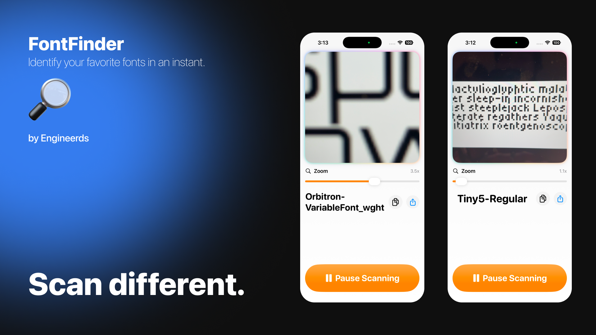

# FontFinder 🔍

Identify your favourite fonts in an instant.

## About

Hey students, graphics designers and typeface enthusiasts~

Ever came across a **font somewhere out in the wild** that you wants to **use in your designs**, but you just **can't figure out the name** of the font regardless of where you look?

With *FontFinder*, point the camera at a sample of the text in question, and the app will instantly identify the font and present to you its name.

## Tech stack

- Swift & SwiftUI
  - Foundation of the application
- CreateML & CoreML
  - Backbones for the Machine Learning powered models
  - Image Classification model
- Python & Pillow
  - Fontface ML training dataset generation pipeline
- 6 distinct font faces from Google Fonts for training - 27000+ image entries in data set
  - Dancing Script
  - Tiny5
  - Bangers
  - Caveat
  - Orbitron
  - Schoolbell

---

Ideation at 11AM, completion by 3PM ⛄️

Brought to life by Adam C, Yining Z, Prudence N and Joshua L on 09/12/2025.

> ✨ Explore Machine Learning with Swift
>
> November 8 - 9, 2025

